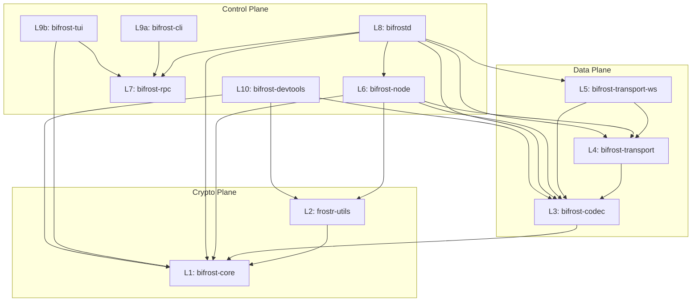

# Architecture -- bifrost-rs

bifrost-rs is a Rust workspace implementing a FROST threshold signing protocol coordinator for Nostr. It enables a group of participants to collaboratively produce Schnorr signatures and compute ECDH shared secrets without any single participant holding the full private key. The system communicates over Nostr relays using ephemeral events with NIP-44 encryption, and exposes a local JSON-RPC interface for operator tooling. The workspace comprises 11 crates organized into three architectural planes with a strict downward-only dependency rule.

---

## Plane Decomposition

The codebase separates concerns into three planes. Each plane has a clear purpose and ownership boundary. Full details are in [`planes.md`](planes.md).

| Plane | Purpose | Crates |
|-------|---------|--------|
| **Crypto** | Pure computation -- FROST signing, ECDH, nonce management. No I/O, no async. | `bifrost-core`, `frostr-utils` |
| **Data** | Serialization, wire formats, transport abstractions, WebSocket transport. | `bifrost-codec`, `bifrost-transport`, `bifrost-transport-ws` |
| **Control** | Orchestration, daemon lifecycle, RPC schema, user interfaces, dev tooling. | `bifrost-node`, `bifrost-rpc`, `bifrostd`, `bifrost-cli`, `bifrost-tui`, `bifrost-devtools` |

The Crypto plane is self-contained. The Data plane depends on Crypto. The Control plane depends on both. No upward dependencies exist.

---

## System Table

All 11 crates with their plane/layer assignment and one-line purpose.

| Layer | Crate | Plane | Purpose |
|-------|-------|-------|---------|
| L1 | `bifrost-core` | Crypto | FROST primitives: group/session/nonce types, partial signature creation/verification/aggregation, ECDH key-share computation |
| L2 | `frostr-utils` | Crypto | Keyset lifecycle (create/verify/rotate/recover), onboarding packages (bech32m encode/decode), stateless sign/ECDH protocol helpers |
| L3 | `bifrost-codec` | Data | JSON-RPC envelope encode/decode, wire type conversions (`*Wire` structs), typed parser entrypoints |
| L4 | `bifrost-transport` | Data | `Transport`, `Clock`, `Sleeper` trait definitions and message types |
| L5 | `bifrost-transport-ws` | Data | WebSocket `Transport` implementation with Nostr event wrapping, NIP-44 encryption, relay failover |
| L6 | `bifrost-node` | Control | `BifrostNode<T, C>` orchestrator: sign/ecdh/ping flows, nonce pool management, replay cache, event streaming |
| L7 | `bifrost-rpc` | Control | Daemon RPC schema, envelope types, `DaemonClient` helper (no workspace dependencies) |
| L8 | `bifrostd` | Control | Headless daemon: Unix socket JSON-RPC server, auth, bounded framing, event collection |
| L9a | `bifrost-cli` | Control | Scriptable CLI client over daemon RPC |
| L9b | `bifrost-tui` | Control | Interactive `ratatui` operator dashboard over daemon RPC |
| L10 | `bifrost-devtools` | Control | `keygen` (threshold keyset generation) and `relay` (local Nostr relay with BIP-340 verify) |

---

## Crate Dependency Graph

Primary wiring diagram showing all workspace dependencies grouped by plane. Full set of diagrams (sign flow, ECDH flow, ping/nonce exchange, daemon RPC, shared state map) is in [`wiring.md`](wiring.md).

---

## Security-Critical Paths

Five properties the system enforces to maintain cryptographic safety.

### 1. Nonce Single-Use Enforcement

FROST signing nonces must never be reused -- reuse leaks the private key. The `NoncePool` (L1) enforces this with a spent-code set. `take_outgoing_signing_nonces()` removes the nonce from the secret map, inserts the code into the spent set, and rejects any subsequent call with the same code. Batch nonce claims (`take_outgoing_signing_nonces_many`) validate all codes before consuming any (atomic all-or-nothing). See [`implicit-behaviors.md` section 3.10](implicit-behaviors.md#310-nonce-single-use-enforcement).

### 2. NIP-44 Encryption

All peer-to-peer messages are encrypted using a NIP-44-style scheme before being published as Nostr events. The transport layer (L5) derives a conversation key via ECDH + HKDF (salt `b"nip44-v2"`), then encrypts with ChaCha20 using a random 32-byte nonce. The encrypted payload carries a version byte (`2`) that is validated on decryption. See [`implicit-behaviors.md` section 2.1](implicit-behaviors.md#21-protocol-constants).

### 3. Secret Key Zeroing

`SharePackage` (L1) derives `Zeroize` with `#[zeroize(drop)]`, ensuring the 32-byte secret key share is zeroed from memory when the struct is dropped. This prevents key material from persisting in freed memory. See [`implicit-behaviors.md` section 3.9](implicit-behaviors.md#39-sharepackage-implements-zeorizedrop).

### 4. Replay Protection

The node (L6) maintains a replay cache (`HashMap<String, u64>`) that records every processed request ID with its timestamp. Inbound requests are rejected if the ID was already seen (replay) or if the timestamp component is older than `request_ttl_secs` (stale envelope). The cache is bounded at `request_cache_limit` entries with LRU eviction. See [`implicit-behaviors.md` section 3.11](implicit-behaviors.md#311-request-id-format).

### 5. Sender/Member Binding

Inbound message handlers validate that the sender's public key is a valid member of the group. The transport layer (L5) attaches the sender's 33-byte compressed public key as a Nostr `"b"` tag on every outgoing event, and inbound processing matches this tag against the group member list. The node layer (L6) enforces that the responding peer is the expected member for the session.

---

## Cross-References

| Artifact | Contents |
|----------|----------|
| [`planes.md`](planes.md) | Full plane/layer decomposition with modules, types, and functions for each of the 11 crates |
| [`wiring.md`](wiring.md) | Mermaid diagrams: crate dependency graph, sign flow, ECDH flow, ping/nonce exchange, daemon RPC flow, shared state map |
| [`libraries.md`](libraries.md) | Dependency audit of all direct dependencies with version, purpose, maintenance status, risk level, and notes |
| [`implicit-behaviors.md`](implicit-behaviors.md) | Catalog of environment variables, hardcoded constants, undocumented conventions, error codes, and defaults with file:line references |

---

## Glossary

| Term | Definition |
|------|------------|
| **FROST** | Flexible Round-Optimized Schnorr Threshold signatures. A protocol allowing *t* of *n* participants to collaboratively produce a Schnorr signature without reconstructing the full private key. |
| **Threshold** | The minimum number of participants (*t*) required to produce a valid signature. A *(t, n)* scheme has *n* total shares. |
| **Group Package** | The public parameters shared by all group members: group public key, threshold, and member list. |
| **Share Package** | A single member's private share: their index and secret key fragment. The secret key is zeroed on drop. |
| **Partial Signature** | A single member's contribution to a threshold signature. Must be combined with at least *t - 1* other partial signatures to produce the final Schnorr signature. |
| **Nonce Commitment** | A public value derived from a secret signing nonce. Each nonce commitment is single-use -- reuse would leak the secret key. Commitments are exchanged during ping to build a nonce pool. |
| **NoncePool** | Per-peer pool of incoming (received) and outgoing (generated) nonce commitments. Enforces single-use via spent-code tracking. |
| **Sighash** | The message digest to be signed. Computed as `SHA-256(message)`, then bound to the session via `SHA-256(session_id \|\| sighash)`. |
| **Session** | A signing or ECDH round with a specific member subset. Has a deterministic ID derived from group ID, members, hashes, content, kind, and timestamp. |
| **ECDH** | Elliptic Curve Diffie-Hellman. Used both for peer-to-peer encrypted transport (NIP-44 conversation keys) and as a threshold operation (combining key-shares to derive a shared secret). |
| **NIP-44** | Nostr Implementation Possibility 44 -- a versioned encryption scheme using ECDH + HKDF + ChaCha20. Used by the WebSocket transport for message confidentiality. |
| **Nostr Relay** | A server that accepts and routes Nostr events. bifrost-rs uses relays as the transport layer, publishing ephemeral events (kind `20_000`) encrypted with NIP-44. |
| **Onboarding Package** | A bech32m-encoded blob (`bfonboard1...`) containing a member's share package, peer public key, and relay list. Used to provision new participants. |
| **Cast** | The transport operation that multicasts a message to multiple peers and gathers threshold responses. Unlike `request` (single peer), `cast` targets a set of peers and waits for the required number of replies. |
| **Wire Type** | A `*Wire` struct in `bifrost-codec` representing the JSON-serializable form of a core type. All byte arrays are hex-encoded strings. Wire types maintain compatibility with the TypeScript implementation (bifrost-ts). |
| **Replay Cache** | A bounded map of seen request IDs to timestamps. Prevents processing the same request twice and rejects requests older than a configurable TTL. |
| **BIP-340** | Bitcoin Improvement Proposal 340 -- Schnorr signatures for secp256k1. The final signature format produced by FROST aggregation. Also used to sign Nostr events. |
