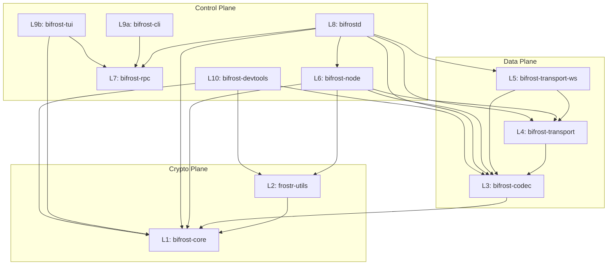
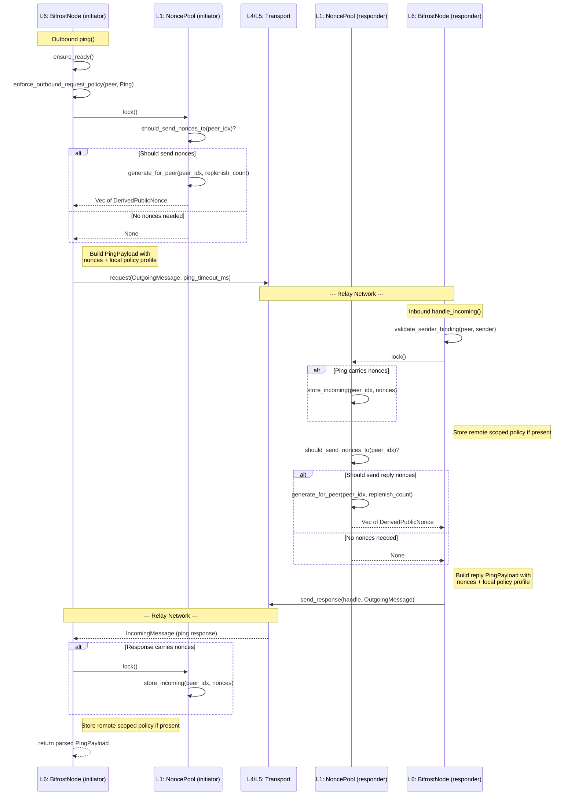
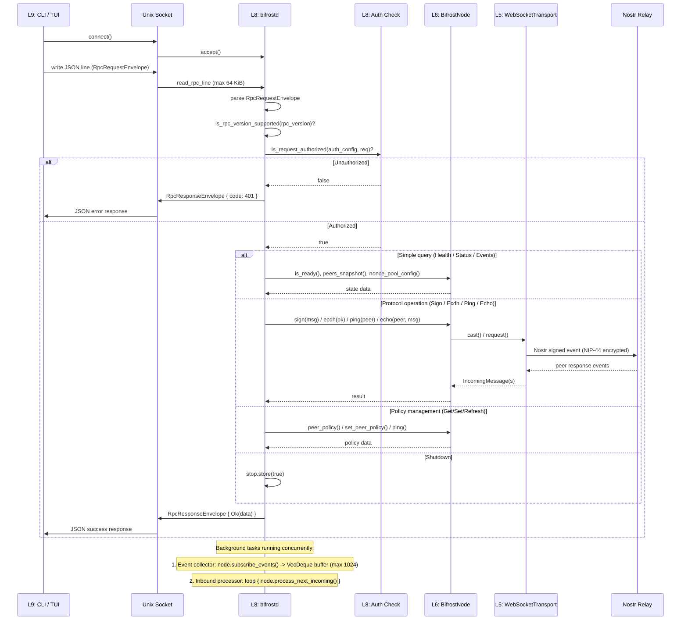
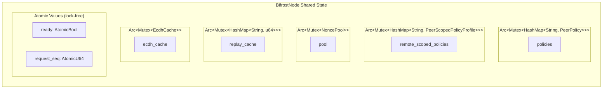

# Wiring Diagrams

This document provides Mermaid diagrams illustrating data flow, dependency edges, and shared state within bifrost-rs. Each diagram is annotated with layer numbers (L1--L10) and plane names (Crypto, Data, Control) as defined in `planes.md`.

---

## 1. Crate Dependency Graph

The 11 workspace crates grouped by architectural plane. Directed edges represent workspace-level `Cargo.toml` dependencies (higher depends on lower). The Crypto plane is self-contained, the Data plane depends on Crypto, and the Control plane depends on both.



---

## 2. Sign Flow

Traces `BifrostNode::sign()`, which delegates to `sign_batch()` for a single message. The flow begins with peer selection and nonce consumption, creates a session package, multicasts to peers via `Transport::cast`, collects and verifies partial signatures, then aggregates them into the final Schnorr signature. All nonce operations are guarded by `Mutex<NoncePool>`.

```mermaid
sequenceDiagram
    participant Caller
    participant Node as L6: BifrostNode
    participant Policy as L6: policies (Mutex)
    participant Pool as L1: NoncePool (Mutex)
    participant Session as L1: create_session_package
    participant Transport as L4/L5: Transport
    participant Codec as L3: bifrost-codec
    participant Utils as L2: frostr-utils
    participant Core as L1: bifrost-core

    Caller->>Node: sign(message)
    Node->>Node: sign_batch(&[message])
    Node->>Node: ensure_ready()

    Note over Node,Policy: Peer Selection
    Node->>Policy: lock() -- read policies
    Node->>Pool: lock() -- check can_sign per peer
    Node-->>Node: select_signing_peers()
    Note right of Node: If InsufficientPeers,<br/>refresh_unknown_policy_peers<br/>then retry selection

    Note over Node,Pool: Nonce Consumption
    Node->>Pool: lock()
    loop For each selected peer, for each hash
        Pool->>Pool: consume_incoming(peer_idx)
    end
    Pool->>Pool: generate_for_peer(self_idx, count)
    Note right of Pool: Self nonce codes saved<br/>for later signing nonce retrieval

    Note over Node,Session: Session Creation
    Node->>Session: create_session_package(group, template)
    Session-->>Node: SignSessionPackage
    Node->>Node: validate_sign_session()

    Note over Node,Transport: Multicast to Peers (async)
    Node->>Codec: SignSessionPackageWire::from(session)
    Codec-->>Node: RpcEnvelope with Sign payload
    Node->>Transport: cast(envelope, selected_peers, threshold, timeout)
    Transport-->>Node: Vec of IncomingMessage responses

    Note over Node,Core: Local Partial Signature
    Node->>Pool: lock()
    Pool->>Pool: take_outgoing_signing_nonces_many(self_idx, codes)
    Pool-->>Node: signing nonces
    Node->>Utils: sign_create_partial(group, session, share, nonces)
    Utils->>Core: create_partial_sig_packages_batch(...)
    Core-->>Utils: PartialSigPackage
    Utils-->>Node: local PartialSigPackage

    Note over Node,Core: Verify Peer Responses
    loop For each peer response
        Node->>Node: assert_expected_response_peer()
        Node->>Codec: parse_psig(envelope)
        Codec-->>Node: PartialSigPackage
        Node->>Utils: sign_verify_partial(group, session, pkg)
        Utils->>Core: verify partial signature
    end

    Note over Node,Core: Aggregate Signatures
    Node->>Utils: sign_finalize(group, session, all_pkgs)
    Utils->>Core: combine_signatures_batch(...)
    Core-->>Utils: Vec of SignatureEntry
    Utils-->>Node: Vec of SignatureEntry
    Node-->>Caller: [u8; 64] signature
```

---

## 3. ECDH Flow

Traces `BifrostNode::ecdh()`. The method first checks the in-memory ECDH cache for a non-expired entry (shortcut path). On cache miss, it selects peers, computes a local key-share, multicasts to peers, collects and combines key-shares, then stores the result in the cache before returning.

```mermaid
sequenceDiagram
    participant Caller
    participant Node as L6: BifrostNode
    participant Cache as L6: EcdhCache (Mutex)
    participant Policy as L6: policies (Mutex)
    participant Transport as L4/L5: Transport
    participant Codec as L3: bifrost-codec
    participant Utils as L2: frostr-utils

    Caller->>Node: ecdh(pubkey)
    Node->>Node: ensure_ready()

    Note over Node,Cache: Cache Check (shortcut path)
    Node->>Cache: lock() -- get_cached_ecdh(pubkey, now)
    alt Cache hit and not expired
        Cache-->>Node: Some(shared_secret)
        Node-->>Caller: [u8; 32] shared_secret
    else Cache miss or expired
        Cache-->>Node: None

        Note over Node,Policy: Peer Selection
        Node->>Policy: lock() -- read policies + remote profiles
        Node-->>Node: select_signing_peers(Ecdh)

        Note over Node,Utils: Local ECDH Key-Share
        Node->>Utils: ecdh_create_from_share(members, share, [pubkey])
        Utils-->>Node: local EcdhPackage

        Note over Node,Transport: Multicast to Peers (async)
        Node->>Codec: EcdhPackageWire::from(local_pkg)
        Codec-->>Node: RpcEnvelope with Ecdh payload
        Node->>Transport: cast(envelope, selected_peers, threshold, timeout)
        Transport-->>Node: Vec of IncomingMessage responses

        Note over Node,Utils: Collect and Verify Peer Responses
        loop For each peer response
            Node->>Node: assert_expected_response_peer()
            Node->>Codec: parse_ecdh(envelope)
            Codec-->>Node: EcdhPackage
        end

        Note over Node,Utils: Combine Key-Shares
        Node->>Utils: ecdh_finalize(all_pkgs, pubkey)
        Utils-->>Node: [u8; 32] shared_secret

        Note over Node,Cache: Store in Cache
        Node->>Cache: lock() -- store_cached_ecdh(pubkey, secret, now)
        Node-->>Caller: [u8; 32] shared_secret
    end
```

---

## 4. Ping / Nonce Exchange

Traces the outbound `BifrostNode::ping()` method and the corresponding inbound ping handler within `handle_incoming()`. Ping is the primary mechanism for exchanging nonce commitments between peers. Each side conditionally generates outgoing nonces (if the pool indicates the peer needs them) and stores any received nonces. Policy profiles are also exchanged during the ping.



---

## 5. Daemon RPC Flow

Traces a request from a CLI or TUI client through the `bifrostd` daemon to the underlying `BifrostNode` and transport layer. The daemon listens on a Unix socket, reads newline-delimited JSON frames (bounded at 64 KiB), performs auth and version checks, dispatches to the node, and writes the response back.



---

## 6. Shared State Map

All shared mutable state within `BifrostNode` (L6). Each entry below identifies the guarded data, the synchronization primitive, and which operations read or write it. The `BifrostNode` struct also contains two atomic values (`AtomicBool` for readiness and `AtomicU64` for request sequencing) that do not require locking.



### Detailed Access Table

| State | Guard | Readers | Writers |
|-------|-------|---------|---------|
| `policies` | `Arc<Mutex<HashMap<String, PeerPolicy>>>` | `peer_policy()`, `peer_policies()`, `peers_snapshot()`, `select_signing_peers()`, `enforce_outbound_request_policy()`, `is_respond_allowed()`, `local_policy_profile_for()` | `set_peer_policy()` |
| `remote_scoped_policies` | `Arc<Mutex<HashMap<String, PeerScopedPolicyProfile>>>` | `select_signing_peers()`, `has_remote_profile_for()` | `store_remote_scoped_policy()` (called from `ping()` outbound handler and `handle_incoming()` ping responder) |
| `pool` (NoncePool) | `Arc<Mutex<NoncePool>>` | `peer_nonce_health()`, `select_signing_peers()` (via `can_sign`) | `ping()` (generate_for_peer, store_incoming), `onboard()` (store_incoming), `sign_batch()` (consume_incoming, generate_for_peer, take_outgoing_signing_nonces_many), `handle_incoming()` Ping/Sign/Onboard handlers |
| `replay_cache` | `Arc<Mutex<HashMap<String, u64>>>` | `check_and_track_request()` (read + write combined) | `check_and_track_request()` (insert, retain, evict) |
| `ecdh_cache` | `Arc<Mutex<EcdhCache>>` | `get_cached_ecdh()` | `store_cached_ecdh()`, `get_cached_ecdh()` (evicts expired entries) |
| `ready` | `AtomicBool` | `is_ready()`, `ensure_ready()` | `connect()` (set true), `close()` (set false) |
| `request_seq` | `AtomicU64` | `request_id()` (fetch_add is read+write) | `request_id()` |
| `events_tx` | `broadcast::Sender<NodeEvent>` (lock-free) | -- | `emit_event()` (called throughout all operations) |

### NoncePool Internal Operations

The `NoncePool` is the most contention-sensitive shared state. Sign operations acquire the lock up to three times in a single `sign_batch()` call:

1. **First lock** -- consume incoming nonces for each peer and generate local nonce commitments
2. **Second lock** -- `take_outgoing_signing_nonces_many()` to retrieve private signing nonces by code
3. (Inbound sign handler) **Third lock** -- optionally generate replenishment nonces for the requesting peer

All NoncePool mutations enforce the single-use nonce invariant. The `take_outgoing_signing_nonces_many` method marks nonce codes as spent and will reject any attempt to reuse a code.
